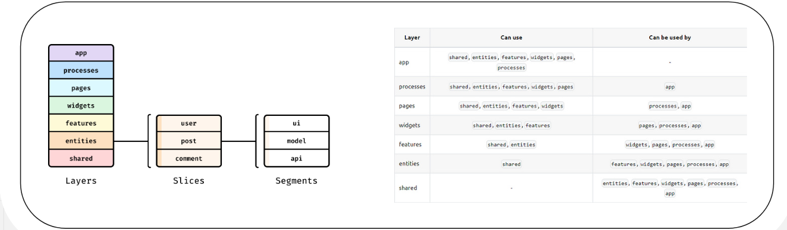

# SoilRX-MVP-App

Final MVP project is created when i studied in Academy Abdrashitova
Link on the site: ) 

# Архитектура проекта

Для разработки функционала следует придерживаться архитектуре [Feature-Sliced Design](https://feature-sliced.design/)



```text
├── app/
| # Слой композиции приложения
| # Содержит только абстрактную логику инициализации и маршрутизации по приложению
| ├──icons/
| # Содержит в себе медиа-контент проекта
| ├──providers/
| # Содержит в себе обработчики определённых механик сервиса
| ├──types/
| # Содержит в себе типы для верхнего уровня
| ├──App
| # Содержит в себе обёртку для маршрутизации по приложению
| ├──index.css
| # Точка входа для Tailwind CSS и содержит глобальные стили проекта
|
├── pages/
| # Срезы, реализующие полные представления для этого приложения
| ├── AddFieldPage
| # Срез, содержащий в себе полное представление страницы для создания поля
| ├── EditFieldPage
| # Срез, содержащий в себе полное представление страницы для редактирования поля
| ├── FieldDetailPage
| # Срез, содержащий в себе полное представление страницы поля
| ├── FieldsPage
| # Срез, содержащий в себе полное представление страницы с таблицей всех полей пользователя
| ├── ForgotPasswordPage
| # Срез, содержащий в себе полное представление страницы "Восстановления пароля"
| ├── LoginPage
| # Срез, содержащий в себе полное представление страницы "Авторизации"
| ├── MainPAge
| # Срез, содержащий в себе полное представление приветственной-ознакамливающей страницы
| ├── PlotFormPage
| # Срез, содержащий в себе полное представление страницы создания/редактирвоания участка
| ├── PlotPage
| # Срез, содержащий в себе полное представление страницы участка
| ├── ProfilePage
| # Срез, содержащий в себе полное представление страницы профиля пользователя
| ├── RegistrationPage
| # Срез, содержащий в себе полное представление страницы регистрации
| ├── ResetPasswordPage
| # Срез, содержащий в себе полное представление страницы сброса пароля (2 этап после восстановления пароля)
|
├── widgets/
| # Срезы, реализующие различные комбинации абстрактных и/или бизнес-блоков с нижележащих слоёв,
| # для предоставления изолированных атомарных фрагментов пользовательского интерфейса
| ├── Footer
| ├── Header
| ├── Layout
| ├──ProfileInformation
| ├──RecomendationSidebar
| ├──RegistrationForm
|
├── features/
| # Срезы, реализующие пользовательские сценарии; обычно здесь приходится оперировать бизнес-объектами
| ├── AddAnalysisModal
| ├── AddField
| ├── AddPlot
| ├── AnalysResult
| ├── AuthByEmail
| ├── ChemicalAnalysisCard
| ├── ConfirmRemoveForm
| ├── CultureRecommendation
| ├── CultureSelect
| ├── Currentrecommendation
| ├── ErrorMessage
| ├── FieldCard
| ├── FieldDetailCard
| ├── ForgotPassword
| ├── HeaderProfile
| ├── HydrogenUnloadinCard
| ├── PersonalInforamationCard
| ├── PersonalSafety
| ├── PlotList
| ├── PLotStack
| ├── RecommendationList
| ├── ResetPassword
| ├── SoilRecommendation
| ├── StackItem
| ├── UploadField
| ├── UploadItem
| ├── WideInfoCard
|
├── entities/
| # Слой содержащий логику различных бизнес моделей сервиса
| ├── Auth/
| # Содержит в себе логику авторизации пользователя
| ├── common/
| # Содержит в себе логику небольших бизнес-моделей
| # Применяются по всему проекту неоднократно
| ├── field/
| # Содержит в себе логику работы с полем
| ├──plot/
| # Содержит в себе логику работы с участком
| ├──recomendation/
| # Содержит в себе логику работы с рекомендацией для участка
| ├──user/
| # Содержит в себе логику работы с личным кабинетом пользователя
|
├── shared/
| # Этот слой – набор абстрактных сегментов и общепереиспользуемых элементов
| # Это означает, что в нём допустимы какие-либо ui-элементы, кастомные библиотеки и любые блоки переиспользуемые по всему проекту
| | ├── api/
| | # Содержит в себе базовые функции запросов к API
| | ├── hooks/
| | # Содержит в себе кастомные хуки
| | ├── lib/
| | # Содержит в себе функции работы с классами и обработкой ошибок
| | ├── model/
| | # Содержит в себе логические обработчики валидации, навгиации, хранения информации
| | ├── types/
| | # Содержит в себе типы используемые по всему проекту
| | ├── ui/
| | # Содержит в себе переиспользуемые UI-элементы
| | | ├── Input/
| | | | ├── Input
| | | | # UI-элемент текстового поля
| | | | ├── Input.stories
| | | | # Импортирование UI-элемента в StoryBook
├── main
| # Точка входа в приложение
```

## Правила нейминга в коде 

| camelCase  |        PascalCase         |             kebab-case              |
|:----------:|:-------------------------:|:-----------------------------------:|
| Переменные | Функциональные компоненты | Переменные конфигурационных файлов  |
|   Методы   |          Классы           |                                     |
|  Функции   |                           |                                     |

*Хуки называть по правилам [React](https://react.dev/reference/react/hooks)<br/>
*Неупомянутые аспекты называть в соответствии с [AirBnb](https://github.com/airbnb/javascript)

## Правила нейминга в файловой системе

| camelCase |        PascalCase         |
|:---------:|:-------------------------:|
|   Слои    | Функциональные компоненты |
|  Слайсы   |          Классы           |
| Сегменты  |                           |

*Хуки называть по правилам [React](https://react.dev/reference/react/hooks)

## Внешние зависимости

### Маршрутизация проекта
- React Router

### Стилизация проекта
- Ant Design

### Работа с API
- RTK-Query

### Библиотеки для разработки собственной бибилиотеки UI-компонентов
- Ant Design
- Zod (Валидация форм)
- react-hook-form (Для обработки событий и взаимодействия с формами)

### Библиотеки для тестирования компонентов
- Storybook

### Библиотеки для сборки проекта
- Vite

### CI/CD библиотеки
- Prettier (AirBnb)
- Eslint (AirBnb)

## Скрипты для запуска и тестирования
- ```npm run dev``` запуск в режиме разработчика
- ```npm run build``` cборка приложения
- ```npm run preview``` запуск в режиме production
- ```npm run sb``` запуск Storybook
- ```npm install``` для загрузки всех необходимых зависимостей
